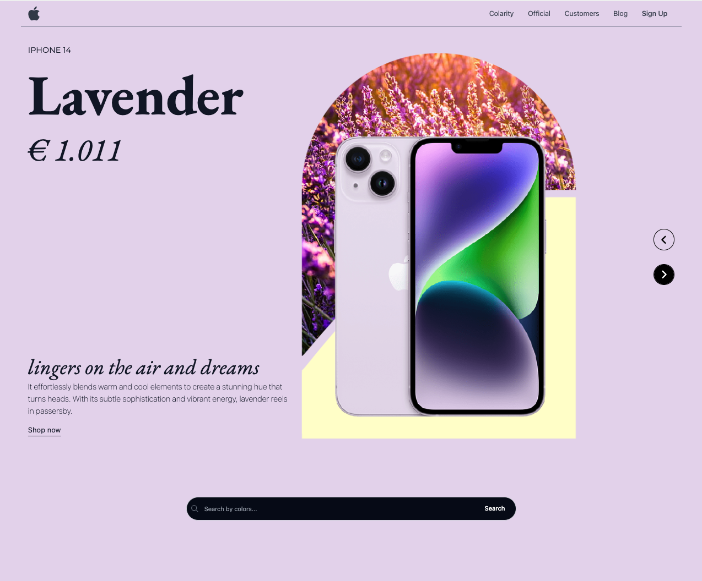

# Hi! #

## Colarity Project

It's a project to practice JavaScript HTML DOM.

HTML | CSS | Tailwind | JavaScript | DOM | Node.js

Have a look at --> [colarity](https://colarity.netlify.app/src/)

https://github.com/estelcm/project_js/assets/118080271/645545ae-9faf-49f5-9dc4-983fbf02b932

- [@estelcm](https://github.com/estelcm)

## 🔗 Links

This project is a replica(ish) and inspired from 'Product Showcase UI' : @TurkAysenur

